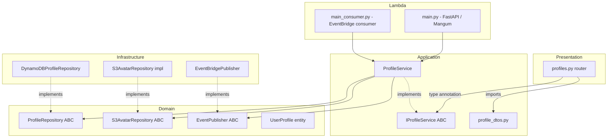
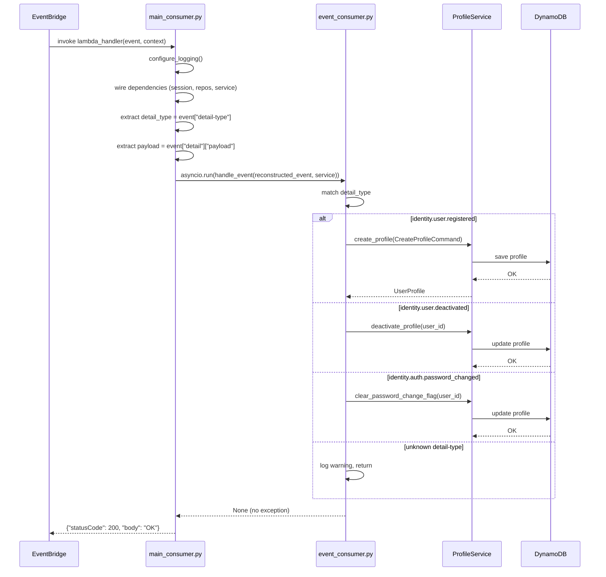

# Design Document — User Profile Enterprise Patterns

## Overview

This design covers four enterprise-pattern gaps in `ugsys-user-profile-service`:

1. **Async EventBridge publisher** — replace synchronous `boto3` with `aioboto3` and surface errors instead of swallowing them silently.
2. **Missing Lambda consumer entry point** — `event_consumer.py` contains routing logic but there is no `main_consumer.py` Lambda handler, making the consumer undeployable.
3. **Application DTO extraction** — request DTOs are defined inline in the router file; `ProfileResponse` serialization is a private helper function rather than a proper DTO.
4. **IProfileService inbound port interface** — `ProfileService` has no ABC, so the presentation layer depends on the concrete class rather than a stable abstraction.

The result is a service where EventBridge publish failures surface as `ExternalServiceError` (never silently swallowed), the event consumer is deployable as a standalone Lambda function, the presentation layer depends on stable DTOs and an interface rather than implementation details, and `ProfileService` is independently testable via mocks.

> **Out of scope**: Outbox pattern, Unit of Work, Circuit Breaker, S3 avatar async migration, and DynamoDB `ClientError` wrapping are explicitly excluded — covered by the `user-profile-hardening` spec or not applicable to this service.

---

## Architecture

### Component Diagram



### Data Flow — Event Consumer



---

## Components and Interfaces

### 1. EventBridgePublisher (modified)

**File:** `src/infrastructure/messaging/event_publisher.py`

The current constructor stores `self._client = boto3.client("events", ...)` — a synchronous client created at startup and reused across calls. The new constructor stores `self._session: aioboto3.Session` and creates a short-lived async client per `publish()` call using an async context manager, consistent with the DynamoDB client pattern in `src/main.py`.

```python
import aioboto3
import structlog
from datetime import datetime, UTC
from uuid import uuid4
from typing import Any
from src.domain.repositories.event_publisher import EventPublisher
from src.domain.exceptions import ExternalServiceError
from src.presentation.middleware.correlation_id import correlation_id_var

logger = structlog.get_logger()
_SOURCE = "ugsys.user-profile-service"


class EventBridgePublisher(EventPublisher):
    def __init__(self, bus_name: str, region: str, session: aioboto3.Session) -> None:
        self._bus_name = bus_name
        self._region = region
        self._session = session

    async def publish(self, detail_type: str, payload: dict[str, Any]) -> None:
        event_id = str(uuid4())
        envelope = {
            "event_id": event_id,
            "event_version": "1.0",
            "timestamp": datetime.now(UTC).isoformat(),
            "correlation_id": correlation_id_var.get(""),
            "payload": payload,
        }
        try:
            async with self._session.client("events", region_name=self._region) as client:
                response = await client.put_events(
                    Entries=[{
                        "Source": _SOURCE,
                        "DetailType": detail_type,
                        "Detail": json.dumps(envelope),
                        "EventBusName": self._bus_name,
                    }]
                )
            if response["FailedEntryCount"] > 0:
                failed = response.get("Entries", [])
                raise ExternalServiceError(
                    message=f"EventBridge put_events partial failure: {failed}",
                    user_message="An unexpected error occurred",
                    error_code="EXTERNAL_SERVICE_ERROR",
                )
        except ExternalServiceError:
            raise
        except Exception as e:
            logger.error(
                "event_publisher.failed",
                detail_type=detail_type,
                error=str(e),
            )
            raise ExternalServiceError(
                message=f"EventBridge put_events raised: {e}",
                user_message="An unexpected error occurred",
                error_code="EXTERNAL_SERVICE_ERROR",
            )
        logger.info("event.published", detail_type=detail_type, event_id=event_id, source=_SOURCE)
```

Key changes from the current implementation:
- Remove `self._client` from `__init__`; add `session: aioboto3.Session` parameter
- `publish()` opens/closes the client per call via `async with` (consistent with DynamoDB pattern)
- `FailedEntryCount > 0` → raise `ExternalServiceError` (was silently ignored)
- `except Exception` → log at `error` level + re-raise as `ExternalServiceError` (was absent entirely)
- Re-raise `ExternalServiceError` directly to avoid double-wrapping

### 2. main_consumer.py (new)

**File:** `src/main_consumer.py`

Standalone Lambda handler — no FastAPI, no Mangum. Uses `asyncio.run()` to drive the async consumer. Wires its own aioboto3 session and clients independently of the main app's lifespan.

The EventBridge envelope structure delivered to Lambda is:
```
event = {
    "detail-type": "identity.user.registered",
    "detail": {
        "event_id": "...",
        "event_version": "1.0",
        "timestamp": "...",
        "correlation_id": "...",
        "payload": {          ← domain event data lives here
            "user_id": "...",
            "email": "...",
            ...
        }
    }
}
```

The handler extracts `payload` from `event["detail"]` and reconstructs a simplified event dict for `handle_event()`:

```python
import asyncio
import json
import structlog
from typing import Any
import aioboto3
from src.config import settings
from src.infrastructure.logging import configure_logging
from src.infrastructure.persistence.dynamodb_profile_repository import DynamoDBProfileRepository
from src.infrastructure.persistence.s3_avatar_repository import S3AvatarRepository
from src.infrastructure.messaging.event_publisher import EventBridgePublisher
from src.infrastructure.messaging.event_consumer import handle_event
from src.application.services.profile_service import ProfileService

configure_logging(settings.service_name)
logger = structlog.get_logger()


def lambda_handler(event: dict[str, Any], context: Any) -> dict[str, Any]:
    detail_type = event.get("detail-type", "")
    logger.info("consumer.invoked", detail_type=detail_type)

    async def _run() -> None:
        session = aioboto3.Session()
        async with (
            session.client("dynamodb", region_name=settings.aws_region) as dynamodb,
            session.client("s3", region_name=settings.aws_region) as s3,
            session.client("events", region_name=settings.aws_region) as _events_client,
        ):
            profile_repo = DynamoDBProfileRepository(
                table_name=settings.profiles_table, client=dynamodb
            )
            avatar_repo = S3AvatarRepository(
                bucket_name=settings.avatars_bucket, client=s3
            )
            publisher = EventBridgePublisher(
                bus_name=settings.event_bus_name,
                region=settings.aws_region,
                session=session,
            )
            service = ProfileService(
                profile_repo=profile_repo,
                avatar_repo=avatar_repo,
                event_publisher=publisher,
            )

            # Extract domain payload from EventBridge envelope
            detail = event.get("detail", {})
            payload = detail.get("payload", detail)
            reconstructed = {"detail-type": detail_type, "detail": payload}
            await handle_event(reconstructed, service)

    try:
        asyncio.run(_run())
        return {"statusCode": 200, "body": "OK"}
    except Exception as e:
        logger.error("consumer.failed", detail_type=detail_type, error=str(e))
        raise
```

Design decisions:
- `configure_logging()` called at module level (outside `lambda_handler`) so it runs once on cold start
- All AWS clients opened inside `_run()` using `async with` — they are closed after each invocation
- `asyncio.run()` creates a fresh event loop per invocation (correct for Lambda)
- On exception: log at `error` level then re-raise — Lambda marks the invocation as failed and triggers retry/DLQ behavior
- The `_events_client` context manager is opened to satisfy the `EventBridgePublisher` session but the publisher manages its own client internally; the outer client is not passed in

### 3. profile_dtos.py (new)

**File:** `src/application/dtos/profile_dtos.py`

Extracts all request DTOs currently defined inline in `src/presentation/api/v1/profiles.py` and introduces `ProfileResponse` with `from_domain()`, replacing the `_profile_dict()` helper.

```python
from __future__ import annotations
from pydantic import BaseModel
from src.domain.entities.profile import UserProfile


class UpdateContactRequest(BaseModel):
    phone: str | None = None
    street: str | None = None
    city: str | None = None
    state: str | None = None
    postal_code: str | None = None
    country: str | None = None


class UpdatePersonalRequest(BaseModel):
    full_name: str | None = None
    date_of_birth: str | None = None


class UpdatePreferencesRequest(BaseModel):
    notification_preferences_email: bool | None = None
    notification_preferences_sms: bool | None = None
    notification_preferences_whatsapp: bool | None = None
    language: str | None = None
    timezone: str | None = None


class UpdateDisplayRequest(BaseModel):
    bio: str | None = None
    display_name: str | None = None


class AddressResponse(BaseModel):
    street: str | None
    city: str | None
    state: str | None
    postal_code: str | None
    country: str | None


class NotificationPreferencesResponse(BaseModel):
    email: bool
    sms: bool
    whatsapp: bool


class ProfileResponse(BaseModel):
    user_id: str
    email: str
    full_name: str
    phone: str | None
    date_of_birth: str | None
    address: AddressResponse
    email_verified: bool
    avatar_url: str | None
    bio: str | None
    display_name: str | None
    language: str
    timezone: str
    notification_preferences: NotificationPreferencesResponse
    deleted_at: str | None

    @classmethod
    def from_domain(cls, profile: UserProfile) -> ProfileResponse:
        return cls(
            user_id=str(profile.user_id),
            email=profile.email,
            full_name=profile.full_name,
            phone=profile.phone,
            date_of_birth=profile.date_of_birth,
            address=AddressResponse(
                street=profile.address.street,
                city=profile.address.city,
                state=profile.address.state,
                postal_code=profile.address.postal_code,
                country=profile.address.country,
            ),
            email_verified=profile.email_verified,
            avatar_url=profile.avatar_url,
            bio=profile.bio,
            display_name=profile.display_name,
            language=profile.language,
            timezone=profile.timezone,
            notification_preferences=NotificationPreferencesResponse(
                email=profile.notification_preferences.email,
                sms=profile.notification_preferences.sms,
                whatsapp=profile.notification_preferences.whatsapp,
            ),
            deleted_at=profile.deleted_at.isoformat() if profile.deleted_at is not None else None,
        )
```

The router replaces every `_profile_dict(profile)` call with `ProfileResponse.from_domain(profile).model_dump()` and removes the `_profile_dict()` function entirely.

### 4. IProfileService ABC (new)

**File:** `src/application/interfaces/profile_service.py`

Declares abstract async methods for all 14 public methods on `ProfileService`. Imports only from `src/domain/` and `src/application/commands/` / `src/application/queries/` — never from infrastructure or presentation.

```python
from abc import ABC, abstractmethod
from uuid import UUID
from src.domain.entities.profile import UserProfile
from src.application.commands.profile_commands import (
    CreateProfileCommand, UpdateContactCommand, UpdatePersonalCommand,
    DeleteProfileCommand, UploadAvatarCommand, DeleteAvatarCommand,
    UpdatePreferencesCommand, UpdateDisplayCommand, SoftDeleteProfileCommand,
)
from src.application.queries.profile_queries import GetProfileQuery, ListProfilesQuery


class IProfileService(ABC):
    @abstractmethod
    async def get_profile(self, query: GetProfileQuery) -> UserProfile: ...

    @abstractmethod
    async def create_profile(self, command: CreateProfileCommand) -> UserProfile: ...

    @abstractmethod
    async def update_contact(self, command: UpdateContactCommand) -> UserProfile: ...

    @abstractmethod
    async def update_personal(self, command: UpdatePersonalCommand) -> UserProfile: ...

    @abstractmethod
    async def delete_profile(self, command: DeleteProfileCommand) -> None: ...

    @abstractmethod
    async def upload_avatar(self, command: UploadAvatarCommand) -> UserProfile: ...

    @abstractmethod
    async def delete_avatar(self, command: DeleteAvatarCommand) -> UserProfile: ...

    @abstractmethod
    async def update_preferences(self, command: UpdatePreferencesCommand) -> UserProfile: ...

    @abstractmethod
    async def update_display(self, command: UpdateDisplayCommand) -> UserProfile: ...

    @abstractmethod
    async def list_profiles(self, query: ListProfilesQuery) -> tuple[list[UserProfile], int]: ...

    @abstractmethod
    async def soft_delete_profile(self, command: SoftDeleteProfileCommand) -> None: ...

    @abstractmethod
    async def get_profile_by_id(self, user_id: UUID) -> UserProfile | None: ...

    @abstractmethod
    async def deactivate_profile(self, user_id: UUID) -> None: ...

    @abstractmethod
    async def clear_password_change_flag(self, user_id: UUID) -> None: ...
```

### 5. ProfileService (modified)

**File:** `src/application/services/profile_service.py`

Single-line change to the class declaration:

```python
# Before
class ProfileService:

# After
class ProfileService(IProfileService):
```

No method signatures change. Python's ABC mechanism will raise `TypeError` at instantiation time if any abstract method is missing — this is the enforcement mechanism.

### 6. profiles.py router (modified)

**File:** `src/presentation/api/v1/profiles.py`

Two changes:

1. Import DTOs from the application layer instead of defining them inline:
```python
# Remove all inline Pydantic model definitions
# Add:
from src.application.dtos.profile_dtos import (
    UpdateContactRequest, UpdatePersonalRequest,
    UpdatePreferencesRequest, UpdateDisplayRequest,
    ProfileResponse,
)
from src.application.interfaces.profile_service import IProfileService
```

2. Replace `_profile_dict(profile)` with `ProfileResponse.from_domain(profile).model_dump()` at every call site, and remove the `_profile_dict()` function.

3. Update the dependency function return type:
```python
def get_profile_service() -> IProfileService:
    return app.state.profile_service
```

---

## Data Models

No new DynamoDB tables or schema changes are introduced by this spec. All changes are to application code only.

### EventBridge Envelope (reference)

The publisher wraps every domain event payload in an envelope before sending to EventBridge:

```json
{
  "event_id": "550e8400-e29b-41d4-a716-446655440000",
  "event_version": "1.0",
  "timestamp": "2025-01-01T12:00:00+00:00",
  "correlation_id": "a1b2c3d4-e5f6-7890-abcd-ef1234567890",
  "payload": {
    "user_id": "01JXXX...",
    "email": "user@example.com",
    "full_name": "Test User"
  }
}
```

When EventBridge delivers this to the consumer Lambda, the full event structure is:

```json
{
  "detail-type": "identity.user.registered",
  "source": "ugsys.identity-manager",
  "detail": {
    "event_id": "550e8400-...",
    "event_version": "1.0",
    "timestamp": "2025-01-01T12:00:00+00:00",
    "correlation_id": "a1b2c3d4-...",
    "payload": {
      "user_id": "01JXXX...",
      "email": "user@example.com",
      "full_name": "Test User"
    }
  }
}
```

`main_consumer.py` extracts `event["detail"]["payload"]` as the domain event data and passes `{"detail-type": detail_type, "detail": payload}` to `handle_event()`.

### main.py wiring update

`src/main.py` must update the `EventBridgePublisher` instantiation to pass the `aioboto3.Session`:

```python
# In lifespan / _wire_dependencies():
session = aioboto3.Session()
publisher = EventBridgePublisher(
    bus_name=settings.event_bus_name,
    region=settings.aws_region,
    session=session,
)
```

---

## Correctness Properties

*A property is a characteristic or behavior that should hold true across all valid executions of a system — essentially, a formal statement about what the system should do. Properties serve as the bridge between human-readable specifications and machine-verifiable correctness guarantees.*

### Property 1: FailedEntryCount triggers ExternalServiceError

*For any* `put_events` response where `FailedEntryCount` is a positive integer, `EventBridgePublisher.publish()` should raise `ExternalServiceError` — regardless of the specific value or the failed entry details.

**Validates: Requirements 2.3, 8.1**

### Property 2: aioboto3 client exceptions always propagate as ExternalServiceError

*For any* exception raised by the aioboto3 EventBridge client during `put_events`, `EventBridgePublisher.publish()` should raise `ExternalServiceError` and should never return normally — the exception is never swallowed.

**Validates: Requirements 2.1, 2.2, 8.2**

### Property 3: Lambda consumer always re-raises handle_event exceptions

*For any* exception raised by `handle_event()`, `lambda_handler` should re-raise that exception after logging — it should never return `{"statusCode": 200}` when `handle_event()` has failed.

**Validates: Requirements 3.7**

### Property 4: ProfileResponse.from_domain() correctly maps all UserProfile fields

*For any* `UserProfile` domain entity, `ProfileResponse.from_domain(profile)` should produce a `ProfileResponse` where `user_id == str(profile.user_id)`, `email == profile.email`, `full_name == profile.full_name`, and `deleted_at` is `profile.deleted_at.isoformat()` when not `None` or `None` when `profile.deleted_at` is `None`.

**Validates: Requirements 5.3, 5.4, 8.4**

### Property 5: IProfileService ABC enforces interface compliance

*For any* concrete class that inherits from `IProfileService` and is missing one or more abstract method implementations, instantiating that class should raise `TypeError`. Conversely, `ProfileService()` (which implements all methods) should not raise `TypeError`.

**Validates: Requirements 7.4, 8.3**

### Property 6: Consumer idempotency — ConflictError on duplicate profile does not propagate

*For any* `identity.user.registered` event where `ProfileService.create_profile()` raises `ConflictError` (profile already exists), `handle_event()` should complete without raising any exception — the consumer is idempotent with respect to duplicate registration events.

**Validates: Requirements 8.5**

### Property 7: Unknown event types do not cause handle_event to raise

*For any* string value used as `detail-type` that is not in `{"identity.user.registered", "identity.user.deactivated", "identity.auth.password_changed"}`, `handle_event()` should complete without raising any exception.

**Validates: Requirements 8.6**

---

## Error Handling

### EventBridgePublisher

| Condition | Behavior |
|-----------|----------|
| `put_events` raises any exception | Log `error` with `detail_type` + `error` fields, raise `ExternalServiceError` |
| `FailedEntryCount > 0` | Raise `ExternalServiceError` with failed entry details in internal `message` |
| `ExternalServiceError` already raised (FailedEntryCount path) | Re-raise directly — no double-wrapping |
| Success (`FailedEntryCount == 0`) | Log `info` with `detail_type` + `event_id` + `source` |

### main_consumer.py

| Condition | Behavior |
|-----------|----------|
| `handle_event()` completes normally | Return `{"statusCode": 200, "body": "OK"}` |
| `handle_event()` raises any exception | Log `error` with `detail_type` + `error` fields, re-raise — Lambda marks invocation failed, triggers retry/DLQ |
| Dependency wiring fails (e.g. DynamoDB client error) | Exception propagates from `asyncio.run()`, caught by outer `except`, logged and re-raised |

### event_consumer.py (existing, no changes required)

| Condition | Behavior |
|-----------|----------|
| `identity.user.registered` and profile already exists (`ConflictError`) | Log warning, return normally — idempotent |
| Unknown `detail-type` | Log warning at `warning` level, return normally |
| Any other exception from `ProfileService` | Propagates to `lambda_handler` — Lambda retries |

### profiles.py router

No error handling changes. The router continues to delegate to `IProfileService` and relies on the domain exception handler middleware for error responses.

---

## Testing Strategy

### Dual Testing Approach

Both unit tests and property-based tests are required. Unit tests cover specific examples, integration points, and error conditions. Property tests verify universal invariants across randomly generated inputs. Together they provide comprehensive coverage.

### Unit Tests

**Location:** `tests/unit/`

Key unit test scenarios:

**EventBridgePublisher** (`tests/unit/infrastructure/test_event_publisher.py`):
- Mock `aioboto3.Session` and verify `async with session.client(...)` is used
- Verify `ExternalServiceError` raised when `FailedEntryCount > 0`
- Verify `ExternalServiceError` raised when `put_events` raises `ClientError`
- Verify success path logs `info` with correct fields

**main_consumer.py** (`tests/unit/test_main_consumer.py`):
- Mock `handle_event` to return normally — verify `{"statusCode": 200, "body": "OK"}` returned
- Mock `handle_event` to raise — verify exception is re-raised
- Verify `detail_type` and `payload` are correctly extracted from the EventBridge envelope

**profile_dtos.py** (`tests/unit/application/test_profile_dtos.py`):
- `ProfileResponse.from_domain()` with a fully populated `UserProfile` — verify all fields
- `ProfileResponse.from_domain()` with `deleted_at=None` — verify `deleted_at` is `None`
- `ProfileResponse.from_domain()` with `deleted_at` set — verify `isoformat()` is called

**IProfileService** (`tests/unit/application/test_iprofile_service.py`):
- Instantiate `ProfileService` — verify no `TypeError`
- Define a stub class missing one method — verify `TypeError` on instantiation

**profiles.py router** (`tests/unit/presentation/test_profiles_router.py`):
- Mock `IProfileService` (not `ProfileService`) — verify router accepts the interface
- Verify `ProfileResponse.from_domain()` is called (not `_profile_dict()`)

### Integration Tests (moto)

**Location:** `tests/integration/`

Use `moto` `mock_aws` to simulate DynamoDB and S3. No real AWS calls.

Key integration scenarios:
- `EventBridgePublisher` with mocked aioboto3 session — verify async context manager lifecycle
- `ProfileService` end-to-end with moto DynamoDB — verify `create_profile` + `get_profile` round-trip
- `main_consumer.py` with mocked `handle_event` — verify dependency wiring completes without error

### Property-Based Tests

**Library:** `hypothesis` (Python)

**Configuration:** minimum 100 examples per property (`@settings(max_examples=100)`)

**Tag format:** `# Feature: user-profile-enterprise-patterns, Property N: <property_text>`

Each correctness property (1–7) maps to exactly one property-based test.

**Property test file locations:**
- `tests/property/test_event_publisher_properties.py` — Properties 1, 2
- `tests/property/test_consumer_properties.py` — Properties 3, 6, 7
- `tests/property/test_profile_dto_properties.py` — Property 4
- `tests/property/test_iprofile_service_properties.py` — Property 5

**Key generators:**

```python
# Property 1: arbitrary positive FailedEntryCount
st.integers(min_value=1, max_value=1000)

# Property 2: arbitrary exceptions
st.sampled_from([
    ClientError({"Error": {"Code": "ThrottlingException", "Message": ""}}, "PutEvents"),
    ConnectionError("network failure"),
    TimeoutError("timeout"),
    RuntimeError("unexpected"),
])

# Property 3: arbitrary exceptions from handle_event
st.sampled_from([ValueError("bad"), RuntimeError("crash"), ConflictError(...)])

# Property 4: arbitrary UserProfile instances
st.builds(
    UserProfile,
    user_id=st.uuids(),
    email=st.emails(),
    full_name=st.text(min_size=1, max_size=100),
    deleted_at=st.one_of(st.none(), st.datetimes(timezones=st.just(UTC))),
    ...
)

# Property 5: stub classes missing 1..14 methods
# Generated programmatically by removing methods from a complete stub

# Property 6: arbitrary user_id UUIDs with ConflictError mock
st.uuids()

# Property 7: arbitrary detail-type strings not in the known set
st.text().filter(lambda s: s not in {
    "identity.user.registered",
    "identity.user.deactivated",
    "identity.auth.password_changed",
})
```

**Property test configuration example:**

```python
from hypothesis import given, settings
from hypothesis import strategies as st

# Feature: user-profile-enterprise-patterns, Property 1: FailedEntryCount triggers ExternalServiceError
@given(failed_count=st.integers(min_value=1, max_value=1000))
@settings(max_examples=100)
async def test_failed_entry_count_raises_external_service_error(failed_count: int) -> None:
    mock_session = AsyncMock()
    mock_client = AsyncMock()
    mock_client.put_events.return_value = {
        "FailedEntryCount": failed_count,
        "Entries": [{"ErrorCode": "InternalFailure"}] * failed_count,
    }
    mock_session.client.return_value.__aenter__.return_value = mock_client

    publisher = EventBridgePublisher(
        bus_name="test-bus", region="us-east-1", session=mock_session
    )
    with pytest.raises(ExternalServiceError):
        await publisher.publish("test.event", {"key": "value"})
```
