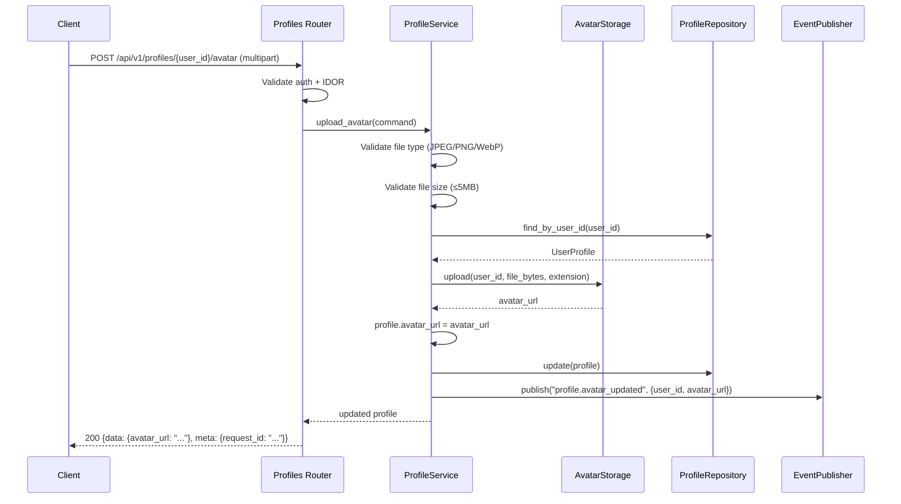
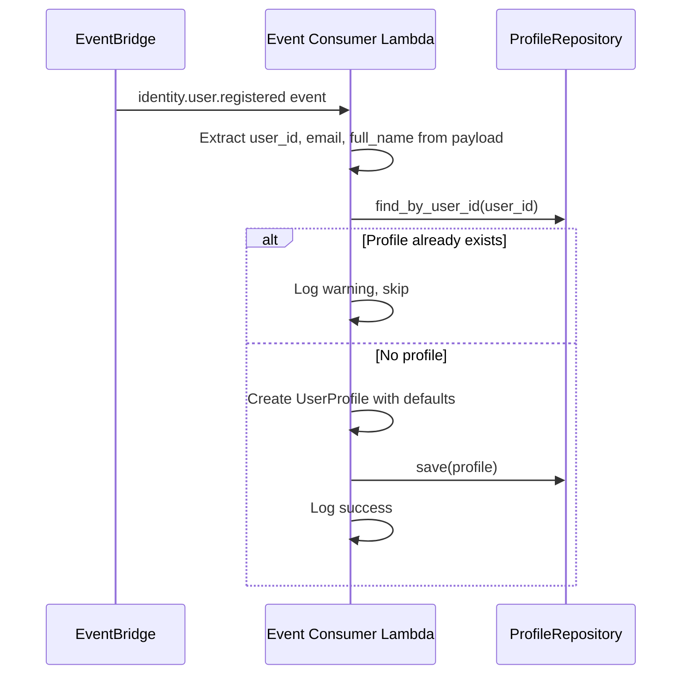
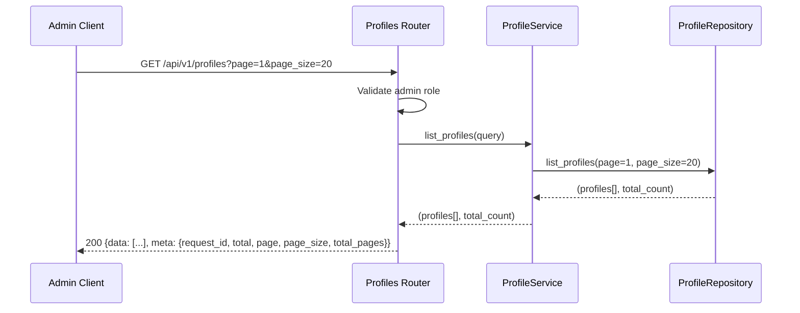

# Design Document — User Profile Service Phase 1 Completion

## Overview

This design closes all remaining implementation gaps in `ugsys-user-profile-service` to reach Phase 1 completion as defined by the platform contract (Section 4). The service already has a working hexagonal architecture with basic CRUD (get, create, update contact/personal, delete), DynamoDB persistence, EventBridge publishing, and all three middleware.

The changes fall into five categories:

1. **Entity completion** — add missing fields (`notification_preferences`, `language`, `timezone`, `avatar_url`, `bio`, `display_name`, `deleted_at`) and new domain methods (`update_preferences()`, `update_display()`, `soft_delete()`)
2. **Domain exception hierarchy** — replace raw `ValueError`/`PermissionError` with structured `DomainError` subtypes that separate internal log messages from user-safe messages
3. **EventBridge consumers** — Lambda handler for inbound events (`identity.user.registered`, `identity.user.deactivated`, `identity.auth.password_changed`)
4. **New endpoints** — avatar upload/delete, admin list with pagination, admin soft-delete, preferences update, display update
5. **Standardization** — response envelope format, `create_app()` factory pattern, event bus name correction to `ugsys-platform-bus`, `EventPublisher` ABC

All changes follow the existing hexagonal architecture. Domain entities and value objects are pure Python with zero external imports, making them instantly testable. Infrastructure adapters implement domain ports (ABCs), enabling unit tests with mocks at the port boundary.

### Design Priority: Testability First

Every component is designed for immediate testability:

- **Domain layer** (entities, value objects, exceptions) — pure Python, no dependencies, testable with plain `pytest`
- **Application layer** (services) — depends only on domain ports (ABCs), testable with `AsyncMock` at the repository boundary
- **Infrastructure layer** (DynamoDB adapter, S3 adapter, event publisher) — implements domain ports, testable with `moto` for integration tests
- **Presentation layer** (routers, middleware, envelope) — testable with FastAPI `TestClient` and mocked services

Implementation order follows testability: domain first (pure logic), then application (mocked ports), then infrastructure (moto), then presentation (TestClient).

## Architecture

The existing hexagonal architecture remains unchanged. New components slot into the established layer structure:

```
┌──────────────────────────────────────────────────────────────────────┐
│                        Presentation Layer                            │
│  ┌──────────────┐  ┌──────────────────────────────────────────────┐  │
│  │ profiles.py   │  │ middleware/                                  │  │
│  │ + avatar      │  │   exception_handler.py (NEW)                │  │
│  │ + preferences │  │   correlation_id.py (existing)              │  │
│  │ + display     │  │   security_headers.py (existing)            │  │
│  │ + admin list  │  │   rate_limiting.py (existing)               │  │
│  │ + admin del   │  └──────────────────────────────────────────────┘  │
│  └──────┬───────┘                                                    │
│         │          ┌──────────────────────────────────────────────┐   │
│         │          │ response_envelope.py (NEW)                   │   │
│         │          │ (success_response, list_response)            │   │
│         │          └──────────────────────────────────────────────┘   │
└─────────┼────────────────────────────────────────────────────────────┘
          │
┌─────────▼────────────────────────────────────────────────────────────┐
│                        Application Layer                              │
│  ┌──────────────────────────────────────────────────────────────────┐ │
│  │ ProfileService (MODIFIED)                                        │ │
│  │ + upload_avatar()    + delete_avatar()                           │ │
│  │ + update_preferences()  + update_display()                      │ │
│  │ + list_profiles()    + soft_delete_profile()                    │ │
│  │ (all existing methods: domain exceptions instead of ValueError)  │ │
│  └──────┬───────────────────────────────────────────────────────────┘ │
│         │ (depends on domain ports only)                              │
│  ┌──────────────────────────────────────────────────────────────────┐ │
│  │ commands/ (NEW commands for new use cases)                       │ │
│  │ queries/ (NEW ListProfilesQuery)                                │ │
│  └──────────────────────────────────────────────────────────────────┘ │
└─────────┼────────────────────────────────────────────────────────────┘
          │
┌─────────▼────────────────────────────────────────────────────────────┐
│                          Domain Layer                                 │
│  ┌────────────────┐  ┌─────────────────────┐  ┌──────────────────┐   │
│  │ UserProfile     │  │ NotificationPrefs   │  │ exceptions.py    │   │
│  │ + new fields    │  │ (value object, NEW) │  │ DomainError base │   │
│  │ + update_prefs()│  └─────────────────────┘  │ + 6 subtypes     │   │
│  │ + update_disp() │                           └──────────────────┘   │
│  │ + soft_delete() │  ┌─────────────────────────────────────────────┐ │
│  └────────────────┘  │ Ports (ABCs)                                 │ │
│                       │  ProfileRepository (+ list_profiles)         │ │
│                       │  EventPublisher (NEW ABC)                    │ │
│                       │  AvatarStorage (NEW ABC)                     │ │
│                       └─────────────────────────────────────────────┘ │
└──────────────────────────────────────────────────────────────────────┘
          ▲                      ▲
┌─────────┴──────────────────────┴─────────────────────────────────────┐
│                       Infrastructure Layer                            │
│  ┌──────────────────────┐  ┌──────────────────────────────────────┐   │
│  │ DynamoDBProfileRepo   │  │ S3AvatarStorage (NEW)               │   │
│  │ + new field ser/deser │  │ upload(), delete()                  │   │
│  │ + list_profiles()     │  └──────────────────────────────────────┘   │
│  └──────────────────────┘                                             │
│  ┌──────────────────────┐  ┌──────────────────────────────────────┐   │
│  │ EventBridgePublisher  │  │ event_consumer.py (NEW)             │   │
│  │ (→ EventPublisher ABC)│  │ Lambda handler for inbound events   │   │
│  │ (ugsys-event-lib fmt) │  └──────────────────────────────────────┘   │
│  └──────────────────────┘                                             │
└───────────────────────────────────────────────────────────────────────┘
```

### Key Sequence Flows

#### Avatar Upload Flow



#### EventBridge Consumer Flow (identity.user.registered)



#### Admin List Profiles with Pagination



## Components and Interfaces

### Domain Layer — New/Modified Components

#### 1. Domain Exceptions (`src/domain/exceptions.py`) — NEW

```python
@dataclass
class DomainError(Exception):
    message: str                          # internal — logs only
    user_message: str = "An error occurred"
    error_code: str = "INTERNAL_ERROR"
    additional_data: dict[str, Any] = field(default_factory=dict)

class ValidationError(DomainError): ...       # 422
class NotFoundError(DomainError): ...         # 404
class ConflictError(DomainError): ...         # 409
class AuthorizationError(DomainError): ...    # 403
class RepositoryError(DomainError): ...       # 500
class ExternalServiceError(DomainError): ...  # 502
```

#### 2. NotificationPreferences Value Object — NEW

```python
@dataclass(frozen=True)
class NotificationPreferences:
    email: bool = True
    sms: bool = False
    whatsapp: bool = False
```

Immutable dataclass. Default values match platform contract: email notifications on, SMS and WhatsApp off.

#### 3. UserProfile Entity Extension — MODIFIED

New fields added to the existing `UserProfile` dataclass:

```python
notification_preferences: NotificationPreferences = field(default_factory=NotificationPreferences)
language: str = "es"                    # ISO 639-1
timezone: str = "America/La_Paz"       # IANA timezone
avatar_url: str | None = None
bio: str | None = None                 # max 500 chars
display_name: str | None = None
deleted_at: datetime | None = None     # soft-delete marker
```

New methods:

```python
def update_preferences(
    self,
    notification_preferences: NotificationPreferences | None = None,
    language: str | None = None,
    timezone: str | None = None,
) -> None:
    """Update only the provided preference fields. Sets updated_at."""

def update_display(
    self,
    bio: str | None = None,
    display_name: str | None = None,
) -> None:
    """Update display fields. Truncates bio to 500 chars. Sets updated_at."""

def soft_delete(self) -> None:
    """Set deleted_at to current UTC timestamp. Sets updated_at."""
```

Design decision: `bio` truncation happens at the entity level in `update_display()` (Req 1.6), but the API layer raises `ValidationError` for bio > 500 chars (Req 12.5). This means the entity is defensive (truncates silently) while the API is strict (rejects). The API validation runs first, so truncation is a safety net.

#### 4. ProfileRepository Extension — MODIFIED

```python
# New method on ProfileRepository ABC
@abstractmethod
async def list_profiles(
    self, page: int, page_size: int,
) -> tuple[list[UserProfile], int]: ...
    # Returns (profiles_page, total_count)
    # Excludes soft-deleted profiles (deleted_at is not None)
```

#### 5. EventPublisher Port (`src/domain/repositories/event_publisher.py`) — NEW

Replace the `EventPublisherProtocol` (typing.Protocol) in ProfileService with a proper domain ABC:

```python
class EventPublisher(ABC):
    @abstractmethod
    async def publish(self, detail_type: str, payload: dict[str, Any]) -> None: ...
```

The source is always `"ugsys.user-profile-service"` — hardcoded in the infrastructure adapter, not passed by callers.

#### 6. AvatarStorage Port (`src/domain/repositories/avatar_storage.py`) — NEW

```python
class AvatarStorage(ABC):
    @abstractmethod
    async def upload(self, user_id: UUID, file_bytes: bytes, extension: str) -> str: ...
        # Returns the avatar URL

    @abstractmethod
    async def delete(self, user_id: UUID, extension: str) -> None: ...
```

### Application Layer — Modified Components

#### ProfileService Changes

- **Constructor** — add `avatar_storage: AvatarStorage` dependency, change `event_publisher` type from `EventPublisherProtocol` to `EventPublisher` ABC
- **upload_avatar(command)** — NEW: validate file type and size, call `AvatarStorage.upload()`, set `avatar_url` on profile, publish `profile.avatar_updated`
- **delete_avatar(command)** — NEW: call `AvatarStorage.delete()`, set `avatar_url = None`, persist
- **update_preferences(command)** — NEW: call `profile.update_preferences()`, persist, publish `profile.updated`
- **update_display(command)** — NEW: validate bio length ≤ 500, call `profile.update_display()`, persist, publish `profile.updated`
- **list_profiles(query)** — NEW: admin-only, call `repo.list_profiles(page, page_size)`, return paginated result
- **soft_delete_profile(command)** — NEW: admin-only, call `profile.soft_delete()`, persist, publish `profile.deleted`
- Replace all `ValueError` raises with `NotFoundError`, `ConflictError`
- Replace all `PermissionError` raises with `AuthorizationError`
- All methods: add `duration_ms` performance logging

#### New Commands

```python
@dataclass(frozen=True)
class UploadAvatarCommand:
    user_id: UUID
    requester_id: str
    is_admin: bool
    file_bytes: bytes
    content_type: str  # e.g. "image/jpeg"

@dataclass(frozen=True)
class DeleteAvatarCommand:
    user_id: UUID
    requester_id: str
    is_admin: bool

@dataclass(frozen=True)
class UpdatePreferencesCommand:
    user_id: UUID
    requester_id: str
    is_admin: bool
    notification_preferences: NotificationPreferences | None = None
    language: str | None = None
    timezone: str | None = None

@dataclass(frozen=True)
class UpdateDisplayCommand:
    user_id: UUID
    requester_id: str
    is_admin: bool
    bio: str | None = None
    display_name: str | None = None

@dataclass(frozen=True)
class SoftDeleteProfileCommand:
    user_id: UUID
    requester_id: str
```

#### New Queries

```python
@dataclass(frozen=True)
class ListProfilesQuery:
    requester_id: str
    is_admin: bool
    page: int = 1
    page_size: int = 20
```

### Infrastructure Layer — New/Modified Components

#### S3AvatarStorage (`src/infrastructure/adapters/s3_avatar_storage.py`) — NEW

Implements `AvatarStorage` ABC. Uploads to `ugsys-avatars-{env}` bucket with key pattern `avatars/{user_id}.{extension}`. Returns the S3 object URL (or CloudFront URL if configured).

```python
class S3AvatarStorage(AvatarStorage):
    def __init__(self, bucket_name: str, region: str = "us-east-1") -> None: ...

    async def upload(self, user_id: UUID, file_bytes: bytes, extension: str) -> str:
        key = f"avatars/{user_id}.{extension}"
        # s3.put_object with ContentType
        return f"https://{self._bucket}.s3.amazonaws.com/{key}"

    async def delete(self, user_id: UUID, extension: str) -> None:
        key = f"avatars/{user_id}.{extension}"
        # s3.delete_object
```

#### EventBridge Consumer (`src/infrastructure/messaging/event_consumer.py`) — NEW

Separate Lambda handler function (not part of the FastAPI app). Processes inbound EventBridge events:

```python
def handler(event: dict, context: Any) -> None:
    detail_type = event.get("detail-type", "")
    detail = event.get("detail", {})

    match detail_type:
        case "identity.user.registered":
            _handle_user_registered(detail)
        case "identity.user.deactivated":
            _handle_user_deactivated(detail)
        case "identity.auth.password_changed":
            _handle_password_changed(detail)
        case _:
            logger.warning("event_consumer.unknown_event", detail_type=detail_type)
```

Each handler function:
- Extracts required fields from the event payload
- Validates required fields are present (logs error and returns on missing)
- Calls the repository directly (no need for the full application service — these are simple operations)
- Handles idempotency (duplicate events don't cause errors)

Design decision: The event consumer uses the repository directly rather than going through ProfileService. This is intentional — event handlers are infrastructure-level orchestration, and the operations are simple enough (create with defaults, soft-delete, clear flag) that adding a service layer would be over-engineering. The domain entity methods (`soft_delete()`, `clear_password_change_flag()`) still enforce business rules.

#### DynamoDBProfileRepository — MODIFIED

- **_to_item / _from_item** — serialize/deserialize all new fields with backward compatibility (missing attributes default to safe values)
- **list_profiles(page, page_size)** — DynamoDB Scan with `FilterExpression` excluding soft-deleted records (`attribute_not_exists(deleted_at) OR deleted_at = :null`), pagination via `ExclusiveStartKey` iteration, returns `(profiles, total_count)`

Design decision: Using Scan for `list_profiles` is acceptable because this is an admin-only endpoint with low frequency. The table size is bounded (community members, not millions of users). If scale becomes a concern, a GSI on `deleted_at` can be added later.

#### EventBridgePublisher — MODIFIED

Migrate from custom class to implement the `EventPublisher` ABC. Use `ugsys-event-lib` envelope format:

```json
{
  "event_id": "<uuid4>",
  "event_version": "1.0",
  "timestamp": "2026-02-24T10:00:00Z",
  "correlation_id": "<from-contextvars>",
  "payload": { ... }
}
```

Source hardcoded to `"ugsys.user-profile-service"`.

### Presentation Layer — New/Modified Components

#### Exception Handler (`src/presentation/middleware/exception_handler.py`) — NEW

```python
STATUS_MAP = {
    ValidationError: 422,
    NotFoundError: 404,
    ConflictError: 409,
    AuthorizationError: 403,
    RepositoryError: 500,
    ExternalServiceError: 502,
}

async def domain_exception_handler(request, exc: DomainError) -> JSONResponse: ...
async def unhandled_exception_handler(request, exc: Exception) -> JSONResponse: ...
```

All error responses wrapped in envelope: `{ "error": { "code": "...", "message": "..." }, "meta": { "request_id": "..." } }`

#### Response Envelope (`src/presentation/response_envelope.py`) — NEW

```python
def success_response(data: Any, request_id: str) -> dict:
    return {"data": data, "meta": {"request_id": request_id}}

def list_response(data: list, total: int, page: int, page_size: int, request_id: str) -> dict:
    return {
        "data": data,
        "meta": {
            "request_id": request_id,
            "total": total,
            "page": page,
            "page_size": page_size,
            "total_pages": ceil(total / page_size) if page_size > 0 else 0,
        },
    }
```

#### Profiles Router — MODIFIED

New endpoints:
- `POST /api/v1/profiles/{user_id}/avatar` — Bearer (own or admin), multipart/form-data
- `DELETE /api/v1/profiles/{user_id}/avatar` — Bearer (own or admin), returns 204
- `PATCH /api/v1/profiles/{user_id}/preferences` — Bearer (own or admin)
- `PATCH /api/v1/profiles/{user_id}/display` — Bearer (own or admin)
- `GET /api/v1/profiles` — admin only, paginated
- `DELETE /api/v1/profiles/{user_id}` — admin only, returns 204

All existing endpoints updated to:
- Remove try/except ValueError/PermissionError blocks (domain exceptions handled by exception_handler)
- Wrap responses in envelope format using `success_response()` / `list_response()`
- Include all new fields in profile response DTO

#### main.py — MODIFIED

Refactored to `create_app()` factory pattern:

```python
def create_app() -> FastAPI:
    app = FastAPI(
        title=settings.service_name,
        version="0.1.0",
        docs_url="/docs" if settings.environment != "prod" else None,
        lifespan=lifespan,
    )

    # Middleware
    app.add_middleware(RateLimitMiddleware)
    app.add_middleware(SecurityHeadersMiddleware)
    app.add_middleware(CorrelationIdMiddleware)

    # Exception handlers (before routers)
    app.add_exception_handler(DomainError, domain_exception_handler)
    app.add_exception_handler(Exception, unhandled_exception_handler)

    # Wire dependencies via constructor injection
    repo = DynamoDBProfileRepository(...)
    avatar_storage = S3AvatarStorage(...)
    publisher = EventBridgePublisher(...)
    profile_service = ProfileService(
        profile_repo=repo,
        event_publisher=publisher,
        avatar_storage=avatar_storage,
    )

    # Inject into routers
    app.dependency_overrides[get_profile_service] = lambda: profile_service

    # Routers
    app.include_router(health.router)
    app.include_router(profiles.router, prefix="/api/v1")

    return app

app = create_app()
handler = Mangum(app)
```

### Config Changes

```python
# src/config.py — changes
event_bus_name: str = "ugsys-platform-bus"  # was "ugsys-event-bus"
avatars_bucket_name: str = ""
version: str = "0.1.0"

@property
def avatars_bucket(self) -> str:
    if self.avatars_bucket_name:
        return self.avatars_bucket_name
    return f"ugsys-avatars-{self.environment}"

@property
def profiles_table(self) -> str:
    return f"ugsys-profiles-{self.environment}"  # corrected from ugsys-user-profiles-{env}
```

## Data Models

### Extended UserProfile Entity (DynamoDB Item)

```json
{
  "pk": "PROFILE#550e8400-e29b-41d4-a716-446655440000",
  "sk": "PROFILE",
  "user_id": "550e8400-e29b-41d4-a716-446655440000",
  "email": "user@example.com",
  "full_name": "John Doe",
  "phone": "+591XXXXXXXX",
  "date_of_birth": "1990-05-15",
  "address": {
    "street": "Av. Heroinas",
    "city": "Cochabamba",
    "state": "Cochabamba",
    "postal_code": "",
    "country": "BO"
  },
  "email_verified": true,
  "require_password_change": false,
  "notification_preferences": {
    "email": true,
    "sms": false,
    "whatsapp": false
  },
  "language": "es",
  "timezone": "America/La_Paz",
  "avatar_url": null,
  "bio": null,
  "display_name": null,
  "deleted_at": null,
  "migrated_from": "registry",
  "migrated_at": "2026-01-15T00:00:00+00:00",
  "created_at": "2026-01-01T00:00:00+00:00",
  "updated_at": "2026-02-24T10:00:00+00:00"
}
```

Backward compatibility: when reading records created before the schema update, missing attributes use defaults:
- `notification_preferences` → `{email: true, sms: false, whatsapp: false}`
- `language` → `"es"`
- `timezone` → `"America/La_Paz"`
- `avatar_url` → `None`
- `bio` → `None`
- `display_name` → `None`
- `deleted_at` → `None`

### DynamoDB Table Schema

Table: `ugsys-profiles-{env}`

| Attribute | Type | Key |
|-----------|------|-----|
| `pk` | String | Partition key — `PROFILE#{user_id}` |
| `sk` | String | Sort key — `PROFILE` |
| `email` | String | GSI-1 PK (`email-index`) |

### Response Envelope DTOs

**Single resource:**
```json
{
  "data": {
    "user_id": "550e...",
    "email": "user@example.com",
    "full_name": "John Doe",
    "phone": "+591XXXXXXXX",
    "date_of_birth": "1990-05-15",
    "address": { "street": "", "city": "Cochabamba", "state": "", "postal_code": "", "country": "BO" },
    "email_verified": true,
    "avatar_url": null,
    "bio": null,
    "display_name": null,
    "language": "es",
    "timezone": "America/La_Paz",
    "notification_preferences": { "email": true, "sms": false, "whatsapp": false },
    "deleted_at": null
  },
  "meta": { "request_id": "a1b2c3d4" }
}
```

**List with pagination:**
```json
{
  "data": [{ "user_id": "...", "email": "...", "..." : "..." }],
  "meta": {
    "request_id": "a1b2c3d4",
    "total": 150,
    "page": 1,
    "page_size": 20,
    "total_pages": 8
  }
}
```

**Error:**
```json
{
  "error": { "code": "NOT_FOUND", "message": "Profile not found" },
  "meta": { "request_id": "a1b2c3d4" }
}
```

### Event Payloads

All events use `ugsys-event-lib` envelope:

```json
{
  "event_id": "<uuid>",
  "event_version": "1.0",
  "timestamp": "2026-02-24T10:00:00Z",
  "correlation_id": "<from-request>",
  "payload": { ... }
}
```

| Event | Trigger | Payload |
|-------|---------|---------|
| `profile.created` | Event consumer (identity.user.registered) | `{ user_id }` |
| `profile.updated` | PATCH /contact, /personal, /preferences, /display | `{ user_id, changed_fields: [...] }` |
| `profile.avatar_updated` | POST /avatar | `{ user_id, avatar_url }` |
| `profile.deleted` | DELETE /profiles/{user_id} (admin) | `{ user_id }` |

### Events Consumed

| Event | Source | Action |
|-------|--------|--------|
| `identity.user.registered` | identity-manager | Create profile with defaults |
| `identity.user.deactivated` | identity-manager | Soft-delete profile |
| `identity.auth.password_changed` | identity-manager | Clear `require_password_change` |


## Correctness Properties

*A property is a characteristic or behavior that should hold true across all valid executions of a system — essentially, a formal statement about what the system should do. Properties serve as the bridge between human-readable specifications and machine-verifiable correctness guarantees.*

### Property 1: UserProfile defaults are correct

*For any* newly created UserProfile with only the required fields (user_id, email, full_name), all new fields shall have their specified defaults: `notification_preferences=NotificationPreferences(email=True, sms=False, whatsapp=False)`, `language="es"`, `timezone="America/La_Paz"`, `avatar_url=None`, `bio=None`, `display_name=None`, `deleted_at=None`.

**Validates: Requirements 1.1, 1.2**

### Property 2: Partial update methods only change provided fields

*For any* UserProfile and any subset of optional parameters passed to `update_preferences()` or `update_display()`, only the provided fields shall change on the entity; all other fields shall retain their previous values. Additionally, `updated_at` shall be set to approximately the current UTC timestamp.

**Validates: Requirements 1.3, 1.4**

### Property 3: soft_delete sets deleted_at

*For any* UserProfile where `deleted_at` is None, calling `soft_delete()` shall set `deleted_at` to approximately the current UTC timestamp and update `updated_at`.

**Validates: Requirements 1.5**

### Property 4: Bio truncation at entity level

*For any* string with length greater than 500 characters, calling `update_display(bio=that_string)` shall result in `bio` having length exactly 500 (the first 500 characters of the input).

**Validates: Requirements 1.6**

### Property 5: NotificationPreferences immutability

*For any* NotificationPreferences instance, attempting to set any attribute shall raise `FrozenInstanceError`. A default-constructed instance shall have `email=True`, `sms=False`, `whatsapp=False`.

**Validates: Requirements 1.7**

### Property 6: ProfileService raises correct domain exceptions

*For any* non-existent user_id, `get_profile` and `update_*` methods shall raise `NotFoundError`. *For any* existing user_id, `create_profile` shall raise `ConflictError`. *For any* non-admin requester accessing a different user's profile, the service shall raise `AuthorizationError`.

**Validates: Requirements 2.2, 2.3, 2.4**

### Property 7: Exception handler maps domain exceptions to HTTP status codes

*For any* `DomainError` subtype in the STATUS_MAP (`ValidationError→422`, `NotFoundError→404`, `ConflictError→409`, `AuthorizationError→403`, `RepositoryError→500`), the `domain_exception_handler` shall return a JSONResponse with the mapped status code and the `user_message` (never the internal `message`) in the response body.

**Validates: Requirements 2.5, 2.7**

### Property 8: Event envelope format

*For any* event published by the EventBridgePublisher, the event detail shall contain `event_id` (valid UUID4), `event_version` (string), `timestamp` (ISO 8601 UTC), `correlation_id` (string), and `payload` (dict).

**Validates: Requirements 3.2**

### Property 9: Profile mutations publish correct events

*For any* successful profile mutation (update contact, update personal, update preferences, update display, avatar upload, admin soft-delete), the EventPublisher shall receive exactly one event with the correct `detail_type` and a payload containing `user_id`.

**Validates: Requirements 3.4, 7.6, 10.5, 12.4**

### Property 10: Event consumer creates profile with correct defaults on registration

*For any* valid `identity.user.registered` event payload containing `user_id`, `email`, and `full_name`, the event consumer shall create a UserProfile with those values and defaults: `language="es"`, `timezone="America/La_Paz"`, `notification_preferences=NotificationPreferences(email=True, sms=False, whatsapp=False)`.

**Validates: Requirements 4.1, 4.2**

### Property 11: Event consumer is idempotent for duplicate registration

*For any* `identity.user.registered` event where a profile already exists for the `user_id`, the event consumer shall not raise an error and shall not modify the existing profile.

**Validates: Requirements 4.3**

### Property 12: Event consumer soft-deletes on deactivation

*For any* valid `identity.user.deactivated` event where a profile exists for the `user_id`, the event consumer shall set `deleted_at` to approximately the current UTC timestamp on the corresponding profile.

**Validates: Requirements 5.1**

### Property 13: Event consumer clears password change flag

*For any* valid `identity.auth.password_changed` event where a profile exists with `require_password_change=True`, the event consumer shall set `require_password_change` to `False` on the corresponding profile.

**Validates: Requirements 6.1**

### Property 14: Avatar upload sets avatar_url on profile

*For any* valid image file (JPEG, PNG, or WebP, ≤5MB) and existing profile, uploading the avatar shall set `avatar_url` to a non-None string on the profile and persist the change.

**Validates: Requirements 7.1**

### Property 15: Invalid avatar files are rejected

*For any* file with content type not in `{image/jpeg, image/png, image/webp}`, or *for any* file with size exceeding 5MB, the avatar upload shall raise `ValidationError` with the appropriate user message.

**Validates: Requirements 7.2, 7.3**

### Property 16: Avatar storage key pattern

*For any* user_id (UUID) and file extension (jpg, png, webp), the S3 storage key shall be `avatars/{user_id}.{extension}`.

**Validates: Requirements 7.5**

### Property 17: Avatar delete clears avatar_url

*For any* profile (with or without an existing avatar), calling delete_avatar shall set `avatar_url` to `None` on the profile without raising an error.

**Validates: Requirements 8.1, 8.2**

### Property 18: Paginated list respects page_size with capping

*For any* page_size value, the list_profiles result shall contain at most `min(page_size, 100)` items. *For any* page_size exceeding 100, the effective page_size shall be capped at 100 without raising an error.

**Validates: Requirements 9.1, 9.2, 9.3**

### Property 19: Admin-only endpoints reject non-admin users

*For any* non-admin requester, calling `list_profiles` or `soft_delete_profile` shall raise `AuthorizationError`.

**Validates: Requirements 9.6, 10.3**

### Property 20: List excludes soft-deleted profiles

*For any* set of profiles in the repository including some with `deleted_at` set, `list_profiles` shall return only profiles where `deleted_at` is None.

**Validates: Requirements 9.7**

### Property 21: DynamoDB serialization round-trip

*For any* valid UserProfile entity with all fields populated (including `notification_preferences` as a Map, `deleted_at` as ISO 8601 or None), serializing to a DynamoDB item via `_to_item()` and then deserializing via `_from_item()` shall produce an equivalent UserProfile.

**Validates: Requirements 13.1, 13.4, 13.5**

### Property 22: DynamoDB backward compatibility defaults

*For any* DynamoDB item missing the new fields (`notification_preferences`, `language`, `timezone`, `avatar_url`, `bio`, `display_name`, `deleted_at`), deserializing via `_from_item()` shall produce a UserProfile with the correct default values for all missing fields.

**Validates: Requirements 13.2**

### Property 23: Bio validation at API level rejects > 500 chars

*For any* string with length greater than 500 characters submitted via the `update_display` endpoint, the ProfileService shall raise `ValidationError` with user message "Bio must not exceed 500 characters".

**Validates: Requirements 12.5**

### Property 24: Response envelope contains request_id from correlation_id

*For any* API response (success or error), the `meta.request_id` field shall equal the `correlation_id` set by the CorrelationIdMiddleware.

**Validates: Requirements 11.1, 11.5**

## Error Handling

### Domain Exception Hierarchy

All errors flow through the structured domain exception hierarchy. The application and domain layers never raise raw `ValueError`, `PermissionError`, or `HTTPException`.

| Exception Type | HTTP Status | When Raised |
|----------------|-------------|-------------|
| `ValidationError` | 422 | Invalid input: bio > 500 chars, invalid file type, file too large |
| `NotFoundError` | 404 | Profile not found for user_id |
| `ConflictError` | 409 | Duplicate profile on create |
| `AuthorizationError` | 403 | IDOR violation (non-admin accessing another user's profile), non-admin calling admin endpoints |
| `RepositoryError` | 500 | DynamoDB or S3 operation failure |
| `ExternalServiceError` | 502 | EventBridge publish failure |

### Error Response Format

All errors are wrapped in the standard envelope:

```json
{
  "error": {
    "code": "NOT_FOUND",
    "message": "Profile not found"
  },
  "meta": {
    "request_id": "a1b2c3d4"
  }
}
```

The `message` field contains only the `user_message` from the domain exception — never the internal `message` which may contain user_ids, table names, or stack traces.

### Unhandled Exceptions

Any exception not in the `DomainError` hierarchy is caught by `unhandled_exception_handler`, which:
1. Logs the full exception with `exc_info=True` (internal)
2. Returns HTTP 500 with generic message `"An unexpected error occurred"` (client)

### Event Consumer Error Handling

The event consumer Lambda handler uses a defensive approach:
- Missing required fields → log error, return (no retry)
- Profile already exists (duplicate registration) → log warning, return
- Profile not found (deactivation/password_changed) → log warning, return
- DynamoDB errors → log error, raise (Lambda retries)

This ensures idempotency and prevents poison-pill events from blocking the queue.

## Testing Strategy

### Design Priority: Testability-First Ordering

Implementation follows strict testability ordering — each layer is fully testable before moving to the next:

1. **Domain layer first** — pure Python, zero dependencies, instant `pytest` feedback
2. **Application layer second** — `AsyncMock` repositories, no AWS needed
3. **Infrastructure layer third** — `moto` for DynamoDB/S3, real SDK calls against fakes
4. **Presentation layer last** — FastAPI `TestClient` with mocked services

### Dual Testing Approach

| Test Type | Purpose | Tool | Min Iterations |
|-----------|---------|------|----------------|
| Unit tests | Specific examples, edge cases, error conditions | pytest | 1 per test |
| Property tests | Universal properties across all inputs | Hypothesis | 100+ per property |

Both are complementary and required:
- Unit tests catch concrete bugs and verify specific edge cases
- Property tests verify general correctness across randomized inputs

### Property-Based Testing Configuration

- **Library**: [Hypothesis](https://hypothesis.readthedocs.io/) (Python's standard PBT library)
- **Minimum iterations**: 100 per property test (Hypothesis default is 100, configurable via `@settings(max_examples=100)`)
- **Each property test MUST reference its design document property** via a comment tag
- **Tag format**: `# Feature: user-profile-phase1-completion, Property {number}: {property_text}`
- **Each correctness property is implemented by a SINGLE property-based test**

### Test Structure

```
tests/
├── unit/
│   ├── domain/
│   │   ├── test_profile_entity.py          # Properties 1-5: entity fields, methods, defaults
│   │   ├── test_notification_preferences.py # Property 5: immutability, defaults
│   │   └── test_exceptions.py              # Exception hierarchy structure
│   ├── application/
│   │   ├── test_profile_service.py         # Properties 6, 9, 14-15, 17-20, 23: service logic
│   │   └── test_event_consumer.py          # Properties 10-13: event consumer logic
│   └── presentation/
│       ├── test_exception_handler.py       # Property 7: STATUS_MAP, envelope format
│       ├── test_response_envelope.py       # Property 24: envelope utilities
│       └── test_profiles_router.py         # Endpoint integration with mocked service
└── integration/
    ├── test_dynamodb_repository.py         # Properties 21-22: round-trip, backward compat
    └── test_s3_avatar_storage.py           # Property 16: key pattern
```

### Property Test Mapping

| Property | Test File | What It Tests |
|----------|-----------|---------------|
| P1: UserProfile defaults | `test_profile_entity.py` | Generate random required fields → verify all defaults |
| P2: Partial update | `test_profile_entity.py` | Generate random profile + random subset of fields → verify only provided change |
| P3: soft_delete | `test_profile_entity.py` | Generate random profile → soft_delete → verify deleted_at ≈ now |
| P4: Bio truncation | `test_profile_entity.py` | Generate strings > 500 chars → update_display → verify len(bio) == 500 |
| P5: NotificationPreferences immutability | `test_notification_preferences.py` | Generate random field names → attempt set → verify FrozenInstanceError |
| P6: Domain exceptions | `test_profile_service.py` | Generate random user_ids → verify correct exception types |
| P7: Exception handler mapping | `test_exception_handler.py` | Generate DomainError subtypes → verify HTTP status + user_message only |
| P8: Event envelope | `test_profile_service.py` | Generate random events → verify envelope fields present |
| P9: Event publishing | `test_profile_service.py` | Generate random mutations → verify correct event type published |
| P10: Consumer registration | `test_event_consumer.py` | Generate random valid payloads → verify profile created with defaults |
| P11: Consumer idempotency | `test_event_consumer.py` | Generate random existing profiles → duplicate event → verify unchanged |
| P12: Consumer deactivation | `test_event_consumer.py` | Generate random profiles → deactivation event → verify deleted_at set |
| P13: Consumer password changed | `test_event_consumer.py` | Generate profiles with flag=True → event → verify flag=False |
| P14: Avatar upload | `test_profile_service.py` | Generate valid files → upload → verify avatar_url set |
| P15: Invalid avatar rejection | `test_profile_service.py` | Generate invalid content types + oversized files → verify ValidationError |
| P16: Avatar key pattern | `test_s3_avatar_storage.py` | Generate random UUIDs + extensions → verify key format |
| P17: Avatar delete | `test_profile_service.py` | Generate profiles with/without avatar → delete → verify avatar_url=None |
| P18: Pagination capping | `test_profile_service.py` | Generate random page_size values → verify effective ≤ 100 |
| P19: Admin-only rejection | `test_profile_service.py` | Generate non-admin requesters → verify AuthorizationError |
| P20: Soft-delete exclusion | `test_dynamodb_repository.py` | Generate mixed profiles → list → verify no deleted_at in results |
| P21: DynamoDB round-trip | `test_dynamodb_repository.py` | Generate random profiles → _to_item → _from_item → verify equality |
| P22: Backward compat defaults | `test_dynamodb_repository.py` | Generate items missing new fields → _from_item → verify defaults |
| P23: Bio API validation | `test_profile_service.py` | Generate strings > 500 chars → update_display → verify ValidationError |
| P24: Response envelope request_id | `test_response_envelope.py` | Generate random request_ids → verify meta.request_id matches |

### Hypothesis Strategies (Custom Generators)

```python
# tests/strategies.py — shared generators for property tests

from hypothesis import strategies as st
from uuid import UUID

# Valid UUIDs
uuids = st.uuids()

# Valid emails
emails = st.emails()

# Valid full names (non-empty, reasonable length)
full_names = st.text(min_size=1, max_size=100, alphabet=st.characters(whitelist_categories=("L", "Zs")))

# Valid notification preferences
notification_prefs = st.builds(
    NotificationPreferences,
    email=st.booleans(),
    sms=st.booleans(),
    whatsapp=st.booleans(),
)

# Valid content types for avatars
valid_content_types = st.sampled_from(["image/jpeg", "image/png", "image/webp"])
invalid_content_types = st.text(min_size=1).filter(lambda x: x not in {"image/jpeg", "image/png", "image/webp"})

# File bytes within size limit
valid_file_bytes = st.binary(min_size=1, max_size=5 * 1024 * 1024)
oversized_file_bytes = st.binary(min_size=5 * 1024 * 1024 + 1, max_size=6 * 1024 * 1024)

# Bio strings
short_bios = st.text(max_size=500)
long_bios = st.text(min_size=501, max_size=1000)

# Page sizes
page_sizes = st.integers(min_value=1, max_value=200)
```

### Unit Test Examples (Non-Property)

Unit tests complement property tests for specific examples and edge cases:

- Event consumer with missing `user_id` field → logs error, returns
- Event consumer with missing `email` field → logs error, returns
- Avatar delete when no avatar exists → succeeds silently
- `page_size=0` handling
- `create_app()` disables docs when `environment="prod"`
- `create_app()` enables docs when `environment="dev"`
- Unhandled exception handler returns generic 500 message

### Coverage Target

- Unit tests: 80% minimum (CI gate), target 90%+ for domain and application layers
- Integration tests: not counted toward coverage gate
- Property tests: counted toward unit test coverage
